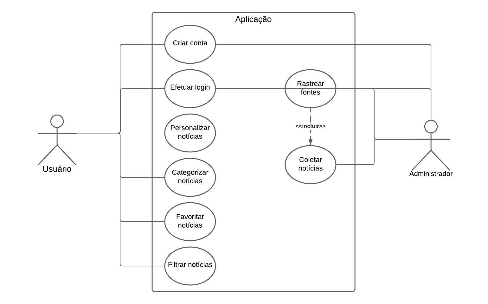

# Especificações do Projeto

O projeto consistirá no desenvolvimento de uma aplicação web que permita aos usuários receberem notícias personalizadas de várias fontes da web. O aplicativo utilizará um crawler para coletar notícias de diferentes sites de notícias, agregando e organizando as informações de acordo com as preferências e interesses de cada usuário.

## Personas
As personas levantadas durante o processo de entendimento do problema são apresentadas nas figuras que se seguem:

<figure> 
  
   
 

Nome: Anderson Moura
   
Idade: 25 anos

Ocupação: Estudante universitário.

Área de Estudo: Jornalismo e Comunicação.

Interesses:
<ul>
<li>Notícias em Tempo Real: Anderson é apaixonado por estar atualizado com as últimas notícias. Ele gosta de saber o que está acontecendo no mundo, seja política, tecnologia, esportes ou cultura.</li>
<li>Tecnologia: Anderson é um entusiasta da tecnologia. Ele acompanha blogs e podcasts sobre inovações, gadgets e tendências.</li>
<li>Redes Sociais:  é ativo nas redes sociais, onde compartilha notícias interessantes e interage com outros estudantes e profissionais da área.</li>
<li>Eventos e Debates: Ele participa de eventos, palestras e debates relacionados a jornalismo e mídia.</li>
</ul>
Comportamento Online:
<ul>
<li>Segue várias fontes de notícias em suas redes sociais e usa aplicativos de notícias para receber atualizações em tempo real.</li>
<li>ele gosta de debater tópicos relevantes e compartilhar informações com seus colegas.</li>
<li>avalia a credibilidade das fontes de notícias que consome.</li>
</ul>
Desafios:
<ul>
<li>Gerenciar o fluxo constante de informações e filtrar notícias relevantes.</li>
<li>Manter-se atualizado com as mudanças rápidas no cenário de notícias.</li>
<li>Encontrar fontes confiáveis e evitar notícias falsas.</li>
</ul>

Objetivos:
<ul>
<li>Se formar em Jornalismo e trabalhar como repórter ou editor.</li>
<li>Contribuir para a sociedade informando e educando através do jornalismo.</li>
<li>Desenvolver habilidades de escrita e comunicação.</li>
</ul>
<figure> 
  
   
 

Nome: Giselle Silva

Idade: 45 anos

Ocupação: Advogada especializada em direito internacional, gerencia o setor juridico de uma empresa Multinacional.

Área de Atuação: Direito Corporativo e Relações Internacionais.

Interesses:
<ul>
<li>Notícias Globais: Giselle é apaixonada por estar atualizada com as principais notícias do mundo. Ela acompanha eventos políticos, econômicos e sociais em diferentes países.</li>
<li>Direito Internacional: Ela está sempre atenta a mudanças nas leis e regulamentos internacionais que possam afetar seus clientes ou suas negociações.</li>
<li>Eventos e Conferências:Giselle participa de conferências e eventos relacionados a direito internacional para expandir sua rede de contatos e aprofundar seu conhecimento.</li>
<li>Literatura Jurídica: Ela lê livros e artigos acadêmicos sobre direito internacional para se manter atualizada.
</ul>
Comportamento Online:
<ul>
<li>Giselle segue fontes confiáveis de notícias internacionais, como agências de notícias, jornais e revistas especializadas.</li>
<li>Ela também participa de fóruns e grupos online para debater questões legais e trocar ideias com outros profissionais.</li>
<li>Giselle é crítica em relação a informações falsas e verifica a credibilidade das fontes antes de compartilhar notícias.</li>
</ul>
Desafios:
<ul>
<li>Gerenciar o volume de informações e filtrar notícias relevantes para sua área de atuação.</li>
<li>Compreender nuances legais em diferentes contextos culturais e jurídicos.</li>
<li>Manter-se atualizada com as mudanças rápidas no cenário global.</li>
</ul>
Objetivos:
<ul>
<li>Continuar aprimorando suas habilidades jurídicas e expandir sua atuação internacional.</li>
<li>Representar clientes em casos complexos envolvendo disputas internacionais.</li>
<li>Contribuir para a justiça e o entendimento mútuo entre diferentes nações.</li>
</ul>

 
## Histórias de Usuários

Com base na análise das personas foram identificadas as seguintes histórias de usuários:

|EU COMO... `PERSONA`| QUERO/PRECISO ... `FUNCIONALIDADE` |PARA ... `MOTIVO/VALOR`|
|--------------------|------------------------------------|-----------------------|
|Anderson Moura|Fazer comentários em notícias e expor minha opinião|Discutir com grupos de interesse comum|
|Anderson Moura|Compartilhar notícias nas redes sociais em que faço parte|Poder discutir com os amigos e colegas de faculdade sobre temas de interesse|
|Giselle Silva|Visualizar as notícias mais relevantes do momento|Tomar conhecimento dos fatos das áreas que atuo e que me interessam|
|Anderson Moura|Ler notícias tanto no desktop quanto no celular|Ocupar o tempo quando estou esperando algo (ex: intervalos de aulas, ônibus/metrô)|
|Giselle Silva|Visualizar notícias mais alinhadas com minha área de atuação|Gastar menos tempo lendo notícias e dar foco naquelas que estão relacionadas com o meu trabalho|
|Giselle Silva|Manter um registro de notícias específicas de interesse particular|Visualizar depois e manter um histórico de notícias que possam ser compartilhadas posteriormente|
|Giselle Silva|Poder realizar uma pesquisa sobre notícias acerca de um tema específico|Localizar tópicos específicos e conseguir maior objetividade em algumas leituras|
|Anderson Moura|Saber a data e a fonte das notícias lidas|Confiar no conteúdo passado e na atualidade das notícias que recebo|

## Requisitos

As tabelas que se seguem apresentam os requisitos funcionais e não funcionais que detalham o escopo do projeto.

### Requisitos Funcionais

|ID    | Descrição do Requisito  | Prioridade |
|------|-----------------------------------------|----|
|RF-001| A aplicação deve permitir ao usuário criar uma conta | ALTA | 
|RF-002|  A aplicação deve permitir ao usuário realizar login  | ALTA |
|RF-003| A aplicação deve ser capaz de rastrear automaticamente múltiplas fontes de notícias online para coletar novas histórias | ALTA | 
|RF-004|  A aplicação deve oferecer a capacidade de personalizar as preferências de notícias de cada usuário, fornecendo um feed de notícias relevante com base em suas escolhas  | MÉDIA |
|RF-005|A aplicação deve permitir que as notícias sejam categorizadas com base em tópicos relevantes, como política, tecnologia, esportes, etc., para que os usuários possam navegar facilmente por suas áreas de interesse | MÉDIA | 
|RF-006|  A aplicação deve oferecer a opção de favoritar as notícias que gostou para vê-las posteriormente  | BAIXA |
|RF-007| A aplicação deve ter mecanismos de busca, com filtros que considerem as preferências dos usuários | MÉDIA | 
 

### Requisitos não Funcionais

|ID     | Descrição do Requisito  |Prioridade |
|-------|-------------------------|----|
|RNF-001| A aplicação deve ser capaz de lidar com grandes volumes de dados de forma eficiente  | ALTA | 
|RNF-002| A aplicação deve garantir a segurança e a confidencialidade das informações pessoais e de contato fornecidas pelos usuários | ALTA | 
|RNF-003|  A aplicação cumprirá a LGPD (Lei Geral de Proteção de Dados) para gestão dos dados cadastrados pelos usuários ou administradores  | ALTA | 
|RNF-004| A aplicação deve ser responsiva e funcionar bem em dispositivos móveis, para acomodar usuários que acessam o site por meio de smartphones e tablets |  MÉDIA | 

## Restrições

O projeto está restrito pelos itens apresentados na tabela a seguir.

|ID| Restrição                                            |
|--|-------------------------------------------------------|
|RE-01| Uso de bibliotecas confiáveis para o crawler (e.g., BeautifulSoup, Scrapy). |
|RE-02| Otimização do desempenho do crawler. |
|RE-03| Autenticação de usuário para login/registro. |
|RE-04| Interface de usuário limpa e intuitiva. |
|RE-05| Uso eficiente do banco de dados para armazenar notícias coletadas e preferências do usuário. |

## Diagrama de Casos de Uso

